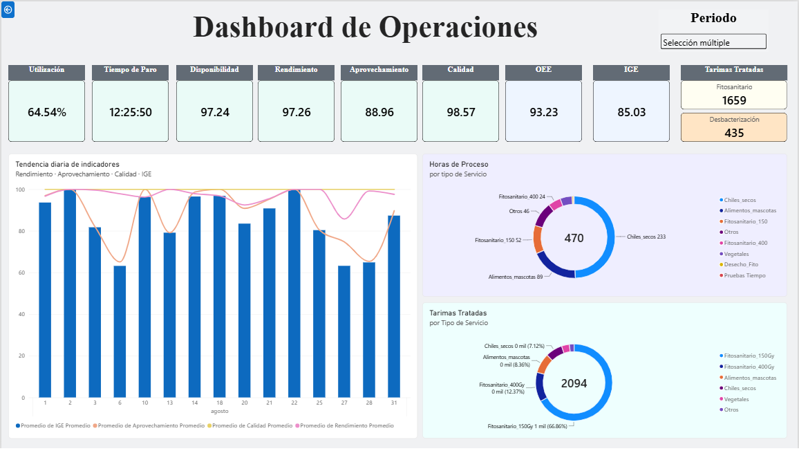
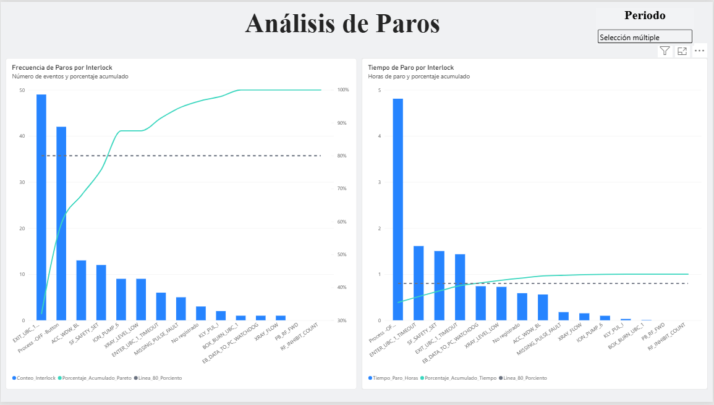
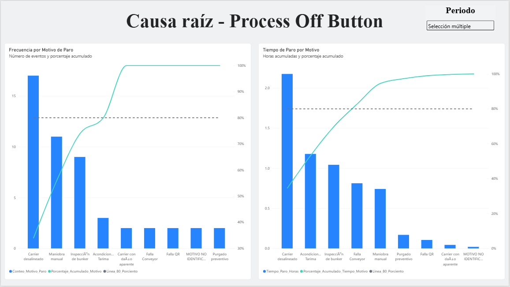

# eBeam Operational Analytics

### Operational Performance Analytics & Business Intelligence Dashboard

An end-to-end analytics project focused on transforming industrial operational data into actionable performance insights using Python and Power BI.

---

## Project Overview

This project transforms operational records from an industrial irradiation process into a structured analytics workflow.

The solution combines Python-based data processing, KPI calculation, data-quality auditing, historical data preparation, and an interactive Power BI dashboard.

The project was developed to support operational performance monitoring, downtime analysis, production analysis, and data-quality assessment.

---

## Business Problem

Industrial operations generate large amounts of information through different operational records.

However, raw operational data is not immediately suitable for analysis. Data must be cleaned, transformed, validated, and structured before meaningful performance indicators can be calculated.

The main challenges addressed by this project were:

- Processing operational records from multiple sources.
- Standardizing data for analysis.
- Calculating operational performance indicators consistently.
- Identifying missing or incomplete operational records.
- Analyzing downtime and process interruptions.
- Preparing historical datasets for Business Intelligence.
- Providing an interactive view of operational performance.

---

## Solution

An end-to-end analytics workflow was developed using Python and Power BI.

The solution separates data preparation and analytical processing from visualization:

**Raw Operational Data → Python → Prepared Analytical Data → Power BI → Operational Insights**

Python is used for data cleaning, transformation, KPI calculations, validation, auditing, and preparation of historical datasets.

Power BI is used for data modeling, interactive analysis, visualization, and operational dashboards.

---

## Data Pipeline

The project follows a structured data pipeline that separates data processing from visualization.

```text
┌─────────────────────────┐
│   Raw Operational Data  │
│                         │
│ • Process records       │
│ • Downtime records      │
│ • Beam ON records       │
│ • Master log            │
│ • Time records          │
└────────────┬────────────┘
             │
             ▼
┌─────────────────────────┐
│         Python          │
│                         │
│ • Data cleaning         │
│ • Transformation        │
│ • KPI calculations      │
│ • Data validation       │
│ • Operational audits    │
│ • Historical processing │
└────────────┬────────────┘
             │
             ▼
┌─────────────────────────┐
│ Prepared Analytical     │
│ Data                    │
│                         │
│ • Historical datasets   │
│ • Monthly KPIs          │
│ • Service times         │
│ • Downtime data         │
│ • Audit results         │
└────────────┬────────────┘
             │
             ▼
┌─────────────────────────┐
│       Power BI          │
│                         │
│ • Data modeling         │
│ • DAX measures          │
│ • Interactive filters   │
│ • KPI visualization     │
│ • Pareto analysis       │
└────────────┬────────────┘
             │
             ▼
┌─────────────────────────┐
│   Operational Insights  │
│                         │
│ • Performance           │
│ • Downtime              │
│ • Production            │
│ • Data quality          │
└─────────────────────────┘
```

---

## Analytical Focus

The solution focuses on five main analytical areas:

- **Operational Performance** — Monitoring process efficiency and performance indicators.
- **Downtime Analysis** — Identifying and analyzing process interruptions and their impact.
- **Production Analysis** — Monitoring treated loads and operational activity.
- **Data Quality** — Detecting incomplete or missing operational records.
- **Historical Analysis** — Preparing structured datasets for monthly and historical comparison.

---

## KPIs & Analytics

The project calculates and analyzes a set of operational performance indicators designed to provide a comprehensive view of the industrial process.

### Operational Performance

- **Availability** — Measures the proportion of scheduled operational time that remains available after accounting for downtime.
- **Utilization** — Measures the use of available operational capacity based on actual beam-on time.
- **Performance** — Compares actual process performance against theoretical process performance.
- **Efficiency** — Evaluates how effectively the process uses its available operational time.
- **Quality** — Measures the proportion of processed services completed without requiring reprocessing.
- **OEE** — Combines Availability, Performance, and Quality into an overall equipment effectiveness indicator.
- **IGE** — Provides an overall operational performance indicator combining the main process efficiency dimensions.

### Production & Process Analysis

The solution also analyzes:

- Treated pallets by service.
- Processing time by service.
- Process execution time.
- Beam ON time.
- Process fragmentation and operational efficiency.
- Monthly operational activity.

### Downtime Analysis

Downtime is analyzed using both frequency and duration:

- Number of downtime events.
- Total downtime hours.
- Interlock events.
- Stop reasons.
- Pareto analysis by event frequency.
- Pareto analysis by accumulated downtime.

This allows operational interruptions to be analyzed from both a frequency and impact perspective.

### Data Quality Analysis

Data quality is incorporated directly into the analytics workflow.

The project includes operational audits designed to identify:

- Missing process records.
- Incomplete operational fields.
- Missing downtime information.
- Incomplete master log records.
- Data registration issues by operator.

This makes data quality part of the analytical process rather than a separate administrative activity.

---

## Technology Stack

### Data Processing & Analysis

- **Python** — Data processing, transformation, validation, KPI calculations, and analytical workflows.
- **Pandas** — Data cleaning, manipulation, aggregation, and preparation of analytical datasets.
- **NumPy** — Numerical operations and supporting calculations.
- **Matplotlib** — Exploratory data analysis and data visualization during the development process.

### Business Intelligence

- **Power BI** — Data modeling, interactive dashboards, KPI monitoring, trend analysis, and operational reporting.
- **DAX** — Measures and calculations used within the Power BI analytical model.

### Data Storage & Exchange

- **CSV** — Structured storage and exchange of processed datasets between the Python pipeline and Power BI.

### Development Approach

The project follows a separation of responsibilities between data processing and visualization:

| Layer | Main responsibility |
|---|---|
| **Python** | Data preparation, transformation, validation, auditing, and analytical calculations |
| **Prepared datasets** | Structured historical and analytical data |
| **Power BI** | Data modeling, interactive analysis, visualization, and reporting |

---

## Project Structure

```text
eBeam-Operational-Analytics/
│
├── README.md
├── .gitignore
│
├── python/
│   └── operational_analytics.py
│
├── data/
│   └── sample_data/
│
├── powerbi/
│   └── dashboard_screenshots/
│
└── documentation/
    ├── architecture.png
    └── data_model.png
```

### Directory Overview

| Directory | Description |
|---|---|
| `python/` | Python scripts used for data processing and analysis |
| `data/sample_data/` | Anonymized or synthetic datasets for demonstration purposes |
| `powerbi/` | Power BI dashboard screenshots and related public materials |
| `documentation/` | Project architecture, data model, and supporting documentation |

## Dashboard Preview

### Monthly Overview



### Downtime Analysis



### Process Off Button Analysis


